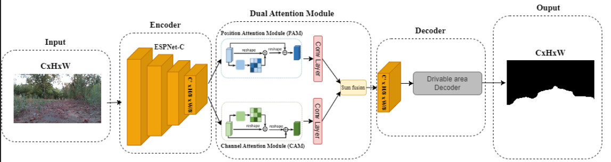
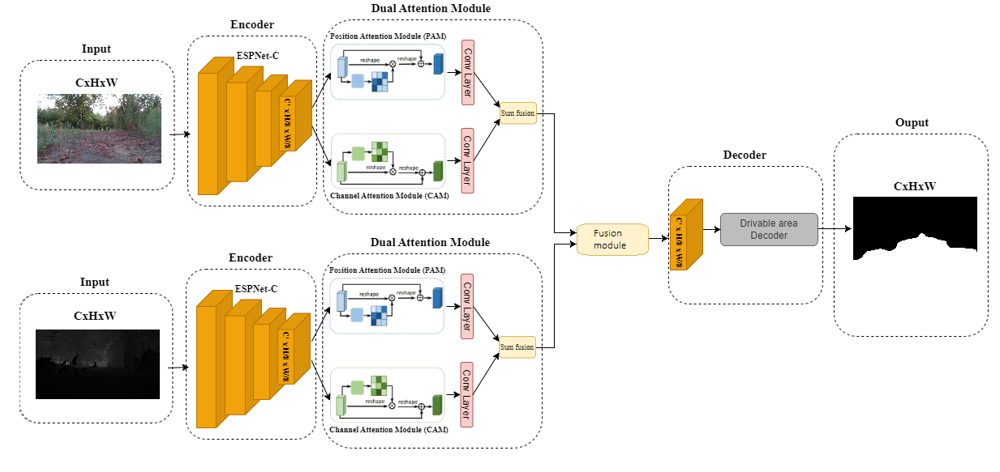

# Real-Time Semantic Segmentation of Drivable Areas in Off-Road Environments

## Project Overview

This project focuses o or identifying drivable areas in off-road environments. The system utilizes various data modalities, including RGB images, depth images, and sensor fusion techniques, to achieve robust performance across diverse terrains and environmental conditions.

## Requirements

For a comprehensive list of dependencies and their respective versions, please refer to the `requirements.txt` file. To install all necessary dependencies, execute the following command:

```bash
pip install -r requirements.txt
```

## Data Preparation

### Dataset Modalities

The project incorporates multiple data modalities to ensure comprehensive environmental understanding:

1. RGB Images: Provide color information for scene analysis under various lighting and weather conditions.
2. Depth Images: Offer distance information to accurately identify obstacles and terrain variations.
3. Sensor Fusion: Combines RGB and depth data for enhanced environmental comprehension, particularly useful in challenging visibility conditions or complex terrains.

### Dataset Composition

The dataset comprises images from three distinct off-road scenarios:

1. Garden: A controlled environment with natural elements and minor obstacles.
2. Trail: A rugged setting featuring uneven paths and complex terrain features.
3. Cultivated Field: Agricultural landscapes with open fields and irregular terrain.

Environmental variations are accounted for by including data collected across different weather conditions (sunny, cloudy, rainy) and times of day (morning, afternoon, dusk).

### Annotation Methodology

Each image in the dataset has been annotated at the pixel level using three semantic classes:

1. Non-Navigable Area: Regions unsuitable for vehicle traversal.
2. Navigable Terrain: Areas safe for navigation.
3. Low Grass: Transitional areas requiring cautious navigation.

### Data Augmentation Techniques

To enhance model generalization, the following data augmentation techniques have been applied:

- Random rotations and flips
- Brightness and contrast variations
- Random cropping

### Dataset Sources

The training dataset incorporates data from the following sources:

1. ORFD Dataset: Outdoor scenarios captured with multiple sensors.
2. BDD100K Dataset: Urban driving dataset adapted for off-road condition testing.
3. DeepScene Dataset: Utilized for cross-environment performance comparisons.
4. Proprietary Dataset: Acquired using the MIVIA Rover.

## Model Architecture

### Original Architecture

The initial model architecture was designed for urban environments:


### Adapted Architecture for Off-Road Single Input

The architecture has been modified for off-road environments by removing the lane-line branch:



### Adapted Architecture for Data Fusion

An extended model incorporating late fusion for multi-modal data has been developed:




## Training
To train the model, execute the above command. The training script supports various configurations through command-line arguments. 
```
python3 train.py --max_epochs 300 --batch_size 16 --lr 5e-4 --savedir results --train_path /path/to/train --valid_path /path/to/valid --sensor_fusion 1 --depth 1 --adaptive 1
```

Example command to start training with sensor fusion enabled:

```bash
- `--freeze_encoder`: Freeze the encoder weights (0 or 1).
- `--encoder_pretrained_rgb`: Path to pretrained weights for the RGB encoder.
- `--encoder_pretrained_depth`: Path to pretrained weights for the depth encoder.
- `--adaptive`: Enable adaptive fusion (0 or 1).
- `--depth`: Enable depth images (0 or 1).
- `--sensor_fusion`: Enable sensor fusion (0 or 1).
- `--valid_path`: Path to the validation dataset.
- `--train_path`: Path to the training dataset.
- `--savedir`: Directory to save the results and checkpoints.
- `--lr`: Initial learning rate.
- `--batch_size`: Number of samples per batch.
- `--max_epochs`: Maximum number of training epochs.
```

## Validation

To validate the model, execute the following command. The validation script supports various configurations through command-line arguments.

```bash
python3 val.py --weight pretrained/best1.pth --test_path /path/to/test --num_workers 1 --batch_size 1 --label BDD100K --sensor_fusion 0 --rgb_folder_name color --label_folder_name labels --depth_folder_name depth --width 640 --height 360 --depth 0 --adaptive 0 --deepscene 0 
```

Command-line Arguments:
```bash
--weight: Path to the pretrained model weights.
--num_workers: Number of parallel threads (default: 1).
--batch_size: Batch size (default: 1).
--test_path: Path to the test dataset (required).
--label: Select the label type to use (default: "BDD100K").
--sensor_fusion: Enable sensor fusion (0 or 1, default: 0).
--rgb_folder_name: Folder name for RGB images (default: "color").
--label_folder_name: Folder name for label images (default: "labels").
--depth_folder_name: Folder name for depth images (default: "depth").
--width: Width of the input image (default: 640).
--height: Height of the input image (default: 360).
--depth: Enable depth estimation (0 or 1, default: 0).
--adaptive: Enable adaptive fusion (0 or 1, default: 0).
--deepscene: Enable deepscene dataset (0 or 1, default: 0).
```

### Demo Inference 

```bash
python3 demo_inference.py
```

### Processed Videos

- **Video Processed with Depth Input**  
  [Watch Video](video_processed/inference_depth.mp4)

- **Video Processed with RGB Input**  
  [Watch Video](video_processed/inference_rgb.mp4)

- **Video Processed with Data Fusion Input**  
  [Watch Video](video_processed/inference_rgbd.mp4)


 